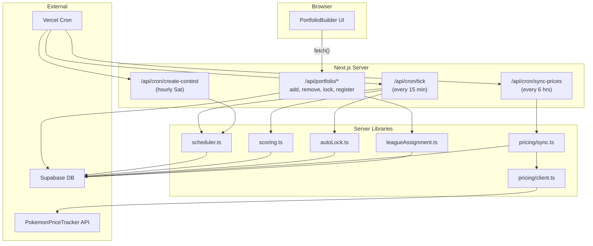

# Packdraft Backend Completion Plan

## Current State

The core database schema, auth, and game logic exist but the backend has several gaps:

- Portfolio writes happen client-side (direct Supabase calls from browser)
- Price data is hardcoded mock data in [app/lib/tcgplayer/sync.ts](app/lib/tcgplayer/sync.ts)
- Contest lifecycle transitions require manual API calls (no automation)
- Scoring must be triggered manually
- Returning users have no way to join new contests (DB trigger only fires on first signup)

## 1. Server-Side Portfolio API Routes

Replace all client-side Supabase writes in [app/components/portfolio/PortfolioBuilder.tsx](app/components/portfolio/PortfolioBuilder.tsx) with server-side API routes. Each route authenticates the user, validates server-side, and uses real prices from the database.

**New files to create:**

- `app/app/api/portfolio/add/route.ts` -- Add/increment a product in the portfolio
  - Accepts `{ productId, quantity? }` (default qty 1)
  - Server fetches latest price from `price_snapshots`
  - Validates: budget cap, slot cap, per-product cap, portfolio not locked
  - Upserts `portfolio_items`, updates `portfolios.cash_remaining`
- `app/app/api/portfolio/remove/route.ts` -- Remove/decrement a product
  - Accepts `{ productId }`
  - Decrements quantity or deletes row if qty reaches 0
  - Updates `portfolios.cash_remaining`
- `app/app/api/portfolio/lock/route.ts` -- Lock the portfolio
  - Sets `is_locked = true`, `submitted_at`, final `price_at_lock` on all items
  - Prices fetched server-side (not from client)
- `app/app/api/portfolio/register/route.ts` -- Join the current contest (for returning users)
  - Finds active registration contest
  - Assigns user to a league (reuses `assignToLeague()` from [app/lib/contest/leagueAssignment.ts](app/lib/contest/leagueAssignment.ts))
  - Creates empty portfolio
  - This fills the gap where the DB trigger only handles brand-new signups

After creating the routes, update `PortfolioBuilder.tsx` to call these endpoints via `fetch()` instead of direct Supabase client writes.

## 2. PokemonPriceTracker API Integration

Replace mock data in [app/lib/tcgplayer/sync.ts](app/lib/tcgplayer/sync.ts) with real price data from the [PokemonPriceTracker API](https://www.pokemonpricetracker.com/api-docs).

**Why PokemonPriceTracker:**

- Dedicated `/api/v2/sealed-products` endpoint (booster boxes, ETBs, UPCs, bundles)
- `/api/v2/cards` endpoint with PSA/CGC/BGS grading data + eBay sales
- Sources prices from TCGPlayer under the hood
- Products keyed by `tcgPlayerId` -- matches the existing `tcgplayer_id` column in the DB
- Free tier: 100 credits/day (1 credit per product, enough for dev)
- $9.99/month: 20,000 credits/day with 6 months price history

**API details:**

- Auth: Bearer token via `Authorization: Bearer YOUR_API_KEY` header
- Sealed products: `GET /api/v2/sealed-products?tcgPlayerId=XXXXX`
- Cards (graded): `GET /api/v2/cards?tcgPlayerId=XXXXX&includeEbay=true` (PSA data via eBay sales)
- Price history: append `&includeHistory=true&days=7` (costs +1 credit/product)
- Bulk set fetch: `GET /api/v2/sealed-products?set=SET_SLUG&includeHistory=true`

**New/modified files:**

- `app/lib/pricing/client.ts` -- PokemonPriceTracker API client (rename from tcgplayer/)
  - Bearer token auth (simple static key, no OAuth flow needed)
  - `getSealedProductPrices(tcgPlayerIds: number[])` -- fetch sealed product prices
  - `getGradedCardPrices(tcgPlayerIds: number[])` -- fetch graded card prices with PSA data
  - Error handling, retries, rate limit awareness (60 calls/min on free tier)
- `app/lib/pricing/sync.ts` -- Rewrite price sync (rename from tcgplayer/)
  - Fetch prices for all active products by their `tcgplayer_id`
  - For sealed products: use `/api/v2/sealed-products`
  - For graded cards: use `/api/v2/cards` with `includeEbay=true`
  - Calculate `change_7d` from API history data or by comparing to DB snapshot from 7 days ago
  - Insert new `price_snapshots` rows
  - Graceful fallback: if API fails, log error but don't crash; keep last known prices
- `supabase/migrations/XXXXXXXXXX_populate_tcgplayer_ids.sql` -- One-time migration
  - Populate `tcgplayer_id` values on existing products with real PokemonPriceTracker/TCGPlayer IDs
  - This requires looking up each product on PokemonPriceTracker to get the correct IDs

**Environment variables needed:**

- `POKEMON_PRICE_TRACKER_API_KEY` -- API key from PokemonPriceTracker

**Folder rename:** Rename `app/lib/tcgplayer/` to `app/lib/pricing/` since we're no longer directly using TCGPlayer. Update imports accordingly.

## 3. Contest Lifecycle Automation (Vercel Cron)

Set up automated cron jobs via [Vercel Cron](https://vercel.com/docs/cron-jobs).

**New/modified files:**

- `vercel.json` (root level) -- Cron schedule configuration:
  - `/api/cron/tick` every 15 minutes -- transitions contest statuses + auto-locks
  - `/api/cron/sync-prices` every 6 hours -- syncs prices from PokemonPriceTracker
  - `/api/cron/create-contest` every hour on Saturdays -- ensures next contest exists
- `app/app/api/cron/tick/route.ts` -- Master lifecycle cron
  - Validates `CRON_SECRET` header (Vercel sends this)
  - Calls `tickContestStatuses()` from [app/lib/contest/scheduler.ts](app/lib/contest/scheduler.ts)
  - On `registration -> active` transition: auto-lock all unlocked portfolios
  - On `active -> complete` transition: trigger scoring via `scoreContest()`
- `app/app/api/cron/sync-prices/route.ts` -- Price sync cron
  - Validates `CRON_SECRET`
  - Calls updated `syncPrices()` (PokemonPriceTracker integration)
- `app/app/api/cron/create-contest/route.ts` -- Contest creation cron
  - Validates `CRON_SECRET`
  - Calls `createNextContest()` to ensure next week's contest exists

**Environment variable needed:**

- `CRON_SECRET` (Vercel provides this automatically)

## 4. Auto-Lock Logic

When a contest transitions from `registration` to `active`, all unlocked portfolios should be auto-locked.

**New file:**

- `app/lib/contest/autoLock.ts`
  - `autoLockPortfolios(supabase, contestId)`: finds all unlocked portfolios for the contest, sets `is_locked = true`, snapshots current prices as `price_at_lock`

This gets called from the cron tick handler when it detects a `registration -> active` transition.

## 5. Returning User Contest Registration

The current DB trigger (`handle_new_user`) only fires on first signup. Returning users need a way to join new contests.

This is handled by the new `/api/portfolio/register` route (described in section 1). The flow:

1. User visits dashboard or draft page
2. Backend checks if they have a portfolio for the current contest
3. If not, they see a "Join This Week's Contest" prompt
4. Clicking it calls `/api/portfolio/register`
5. Server assigns them to a league and creates an empty portfolio

## Architecture After Changes

## Files Changed Summary

**New files (9):**

- `app/app/api/portfolio/add/route.ts`
- `app/app/api/portfolio/remove/route.ts`
- `app/app/api/portfolio/lock/route.ts`
- `app/app/api/portfolio/register/route.ts`
- `app/app/api/cron/tick/route.ts`
- `app/app/api/cron/sync-prices/route.ts`
- `app/app/api/cron/create-contest/route.ts`
- `app/lib/contest/autoLock.ts`
- `supabase/migrations/XXXXXXXXXX_populate_tcgplayer_ids.sql`

**Renamed + rewritten (folder rename `tcgplayer/` -> `pricing/`):**

- `app/lib/pricing/client.ts` -- PokemonPriceTracker API client (bearer token, sealed + graded endpoints)
- `app/lib/pricing/sync.ts` -- Rewrite: real API instead of mock data

**Modified files (2):**

- `app/components/portfolio/PortfolioBuilder.tsx` -- Swap direct Supabase calls for fetch() to API routes
- `vercel.json` -- New: cron schedule config

**New env vars (2):**

- `POKEMON_PRICE_TRACKER_API_KEY`
- `CRON_SECRET` (auto-provided by Vercel)

